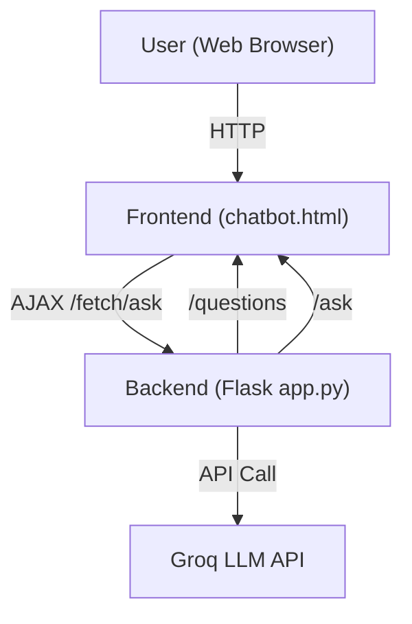

# Career Guidance Chatbot – Comprehensive Documentation

**Author:** Naufal Zeeshan  
**Trainer:** Hasnanin Muawiya

---

## Table of Contents
1. [Project Overview](#project-overview)
2. [Features](#features)
3. [Technologies Used](#technologies-used)
4. [System Architecture](#system-architecture)
5. [File Structure](#file-structure)
6. [Setup Instructions](#setup-instructions)
7. [Usage Guide](#usage-guide)
8. [Backend Details](#backend-details)
9. [Frontend Details](#frontend-details)
10. [AI Model & API Integration](#ai-model--api-integration)
11. [Security Notes](#security-notes)
12. [Customization & Future Improvements](#customization--future-improvements)
13. [Contributing](#contributing)
14. [Contact](#contact)
15. [License](#license)

---

## Project Overview
The Career Guidance Chatbot is an AI-powered web application designed to help users discover suitable career paths based on their interests and personality traits. It provides a friendly, interactive experience, asks a series of questions, and delivers personalized career recommendations with motivational messages.

---

## Features
- Friendly introduction and supportive tone
- 5–6 interactive questions about user interests and preferences
- Personalized career field recommendation (e.g., Engineering, Medicine, Business, Arts, Military, etc.)
- Motivational message with each recommendation
- Option to restart the conversation and try different answers
- Responsive, modern UI (Bootstrap-based)

---

## Technologies Used
- **Frontend:** HTML, CSS, JavaScript, Bootstrap
- **Backend:** Python, Flask
- **AI Model:** Groq API (Llama-3.3-70b-versatile)

---

## System Architecture


---

## File Structure
- `app.py` — Flask backend (API endpoints, AI integration)
- `chatbot.html` — Frontend (UI, chat logic, Bootstrap styling)
- `requirements.txt` — Python dependencies
- `script.py` — Example script for Groq API usage
- `README.md` — Project documentation
- `COMPREHENSIVE_DOCUMENTATION.md` — This file

---

## Setup Instructions
1. **Clone the repository:**
   ```bash
   git clone <your-repo-url>
   cd <your-repo-directory>
   ```
2. **Create and activate a virtual environment:**
   ```bash
   python -m venv .venv
   # On Windows:
   .venv\Scripts\activate
   # On Mac/Linux:
   source .venv/bin/activate
   ```
3. **Install dependencies:**
   ```bash
   pip install -r requirements.txt
   ```
4. **Run the Flask app:**
   ```bash
   python app.py
   ```
5. **Open your browser and go to:**
   [http://127.0.0.1:5000/](http://127.0.0.1:5000/)

---

## Usage Guide
- The chatbot greets the user and explains the process.
- Users answer a series of questions about their interests and preferences.
- After the last question, the chatbot provides a career recommendation and a motivational message.
- The user can click the **Restart** button to try again with different answers.

---

## Backend Details
- **Framework:** Flask
- **Endpoints:**
  - `/` : Serves the frontend HTML file.
  - `/questions` : Returns the list of questions as JSON.
  - `/ask` : Accepts POST requests with user answers, sends them to the Groq LLM, and returns the AI's recommendation and motivational message.
- **AI Integration:**
  - Uses the Groq Python SDK to interact with the Llama-3.3-70b-versatile model.
  - The prompt is dynamically constructed from user answers.
- **Security Note:** The API key is hardcoded for demonstration. For production, use environment variables.

---

## Frontend Details
- **UI:** Responsive, modern chat interface using Bootstrap.
- **Logic:**
  - Fetches questions from `/questions` endpoint on load.
  - Displays questions one by one, collects user answers.
  - After all questions, sends answers to `/ask` endpoint and displays the AI's response.
  - Allows restarting the conversation.
- **Technologies:** HTML, CSS, JavaScript (vanilla), Bootstrap CDN.

---

## AI Model & API Integration
- **Model:** Llama-3.3-70b-versatile via Groq API
- **Integration:**
  - Backend composes a prompt with user answers and sends it to the Groq API.
  - Receives a concise, supportive recommendation and motivational message.
- **script.py:** Example of direct Groq API usage for testing or experimentation.

---

## Security Notes
- **API Key:** The Groq API key is hardcoded in `app.py` and `script.py` for demonstration. **Never commit real API keys to public repositories.**
- **Recommendation:** Use environment variables or a configuration file to store sensitive information in production.
- **.gitignore:** Ensure `.venv/`, `__pycache__/`, and other sensitive files are ignored.

---

## Customization & Future Improvements
- Add more questions or allow dynamic question sets.
- Integrate user authentication for saving progress.
- Store user sessions and recommendations in a database.
- Add support for more languages.
- Improve UI/UX with avatars, animations, or voice support.
- Replace hardcoded API key with secure environment variable management.
- Add analytics or feedback collection.

---

## Contributing
Pull requests are welcome! For major changes, please open an issue first to discuss what you would like to change.

---

## Contact
For questions or suggestions, please open an issue or contact the project maintainer.

---

## License
This project is for educational purposes only. 